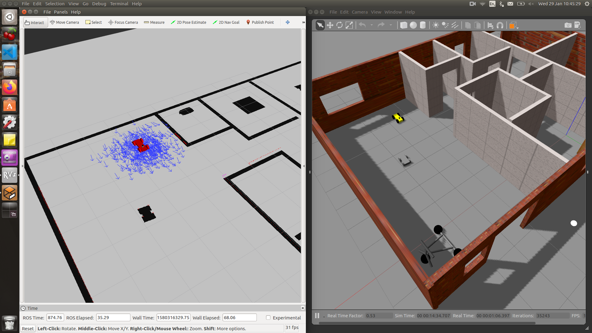
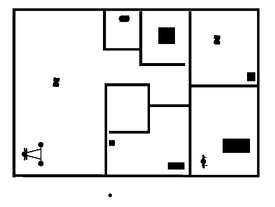
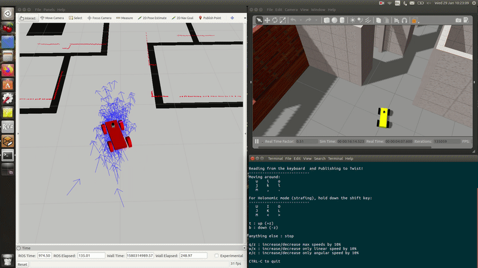

# Adaptive Monte Carlo Localization
## Using Gazabo, Rviz, and ROS



## Setting up the enviroment:
For this project the following set up was used:
- Ubuntu 16.04 LTS OS
- Ros kinetic
- Gazebo 7.0.0
- Rviz 1.12.17

## Installation steps:
- Clone this repository to your home directory:
```
$ git clone https://github.com/AndresGarciaEscalante/Adaptive-Monte-Carlo-Localization.git
```
- Review the documentation and dependecies of the Packages mentioned below.

**Launch files for master branch**:
- Run the following commands in a terminal:
```
$ source devel/setup.bash
$ roslaunch my_robot world.launch
```
- Open a new terminal and execute the following commands:
```
$ source devel/setup.bash
$ roslaunch my_robot amcl.launch
```
- Load the the Rviz configuration located in the rviz_config folder.

- Use the **2D Nav Goal** option to drive around. If the robot lose its position use the **2D Pose Estimate**.

**Launch files for Teleop branch**
- Run the following commands in a terminal:
```
$ source devel/setup.bash
$ roslaunch my_robot world.launch
```
- Open a new terminal and execute the following commands:
```
$ source devel/setup.bash
$ roslaunch my_robot amcl.launch
```
- Finally one more terminal and execute the following commands:
```
$ source devel/setup.bash
$ rosrun teleop_twist_keyboard teleop_twist_keyboard.py 
```
- Load the the Rviz configuration located in the rviz_config folder.

- Using the third terminal you will be allowed to control the robot position with the keyboards.

## Project Description
### my_robot Package
Provides the gazebo world environment and the robot model. 

### pgm_map_creator Package
This package generates a **.pgm** file of a gazebo world. Using this powerful tool I was allowed to generate the folllowing 2D map:


For more detailed information please refere to the following link:
[pgm_map_creator](https://github.com/udacity/pgm_map_creator.git)

### teleop_twist_keyboard Package (Teleop Branch)
Provides a control of the car by using keyboards.

For more detailed information please refere to the following link:
[teleop_twist_keyboard Package](https://github.com/ros-teleop/teleop_twist_keyboard)

## Project Outcome
The main objective of the project is to test the **AMCL** to determine the **position of the robot given a 2D map**.

**master branch**:
- The robot will move to a navigation goal by its own. It only needs a goal point to start the movement.


**Important:** Check full video in the following link:
[AMCL_Autonomous_Project](https://www.youtube.com/watch?v=vw_842utXio)

**Teleop branch**:
- The robot will move by using the keyboards.



**Important:** Check full video in the following link:
[AMCL_Teleop_Project](https://www.youtube.com/watch?v=mieZXECb5GY)
