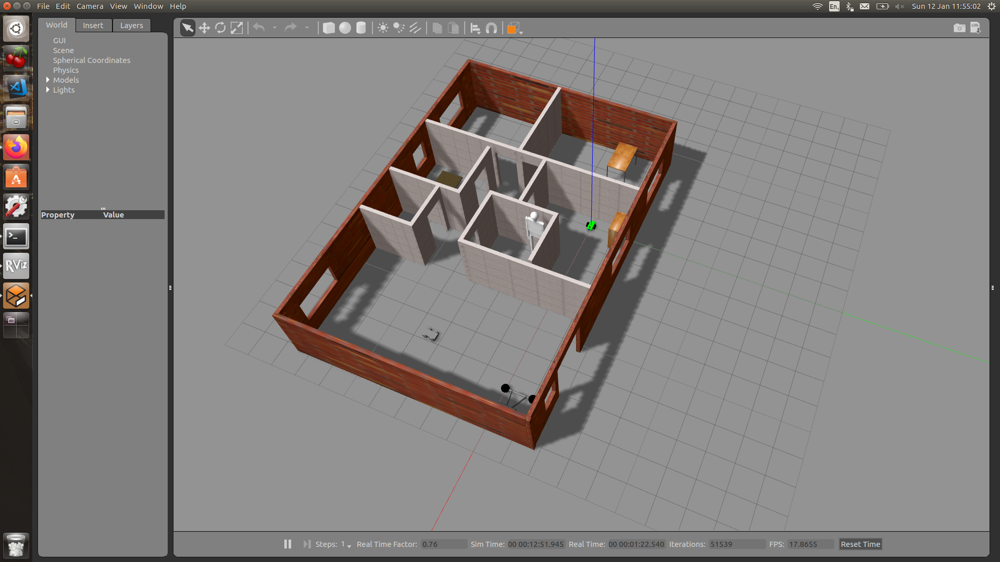
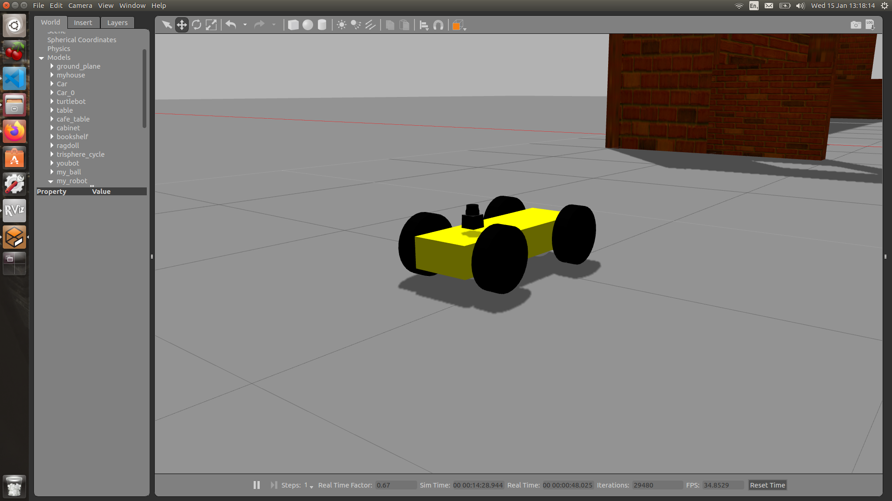

# GoChaseTheBall
## Using Gazabo, Rviz, and ROS
## Andres Ricardo Garcia Escalante



## Setting up the enviroment:
For this project used the following programs:
- Ubuntu 16.04 LTS OS
- Ros kinetic
- Gazebo 7.0.0
- Rviz 1.12.17

## Installation steps:
- Clone this repository to your home directory:
```
$ git clone https://github.com/AndresGarciaEscalante/GoChaseTheBall.git
```
- Install missing ROS dependencies using the rosdep install command:
```
$ cd ~/catkin_ws/
$ rosdep install --from-paths src --ignore-src --rosdistro=kinetic -y
```
- Run catkin_make from within your workspace to build the project:
```
$ cd ~/GoChaseTheBall/
$ catkin_make
```
- Run the following shell commands to source the setup files:
```
$ echo "source ~/GoChaseTheBall/devel/setup.bash" >> ~/.bashrc
```
- To run Gazabo and Rviz simualtion use:
```
$ roslaunch my_robot world.launch
```
- To run the drive_bot and process_image nodes use:
```
$ roslaunch ball_chaser ball_chaser.launch
```

## Project Description
### Gazebo world
The gazebo world was already created in a previous project. Please refer to:

### Unified Robot Description Format (URDF)
This file provided all the information about the ```my_robot``` structrure ```Links, joints,and physics properties``` for the gazebo environment. Additionally, the gazebo files were useful to apply the plugins for all the robot components. 



### drive_bot ROS node
This server node will provide a ball_chaser/command_robot service to drive the robot around by controlling its ```linear x``` and ```angular z``` velocities. The service will publish a message containing the velocities to the wheel joints. 

### process_image ROS node
This client node will subscribe to the robot’s camera images and analyze each image to determine the ```position``` of the white ball. Once ball position is determined, the client node will request a service to drive the robot either ```left```, ```right``` or ```forward```.

## Project Outcome
The main objective of the project is to design a robot model from scratch and being able to follow a white ball in a Gazebo world. Please watch the video to see it in action: 

## Problems during the project
-  Unable to control the four wheel car with the `differential_controller` . This was solved by adding `skid_steer_drive_controller` in the gazebo file.

- The my_robot was not updated when changes were made in the `URDF file`. The cause of it was that the `world file` was saved including the my_robot model and when executed it completly ignored the new `URDF file`. This was solved by removing from the `world file` the my_robot model. 

## Future Improvements
- Apply object recognition to follow specific objects.
- Redesign the car model using a CAD software.
