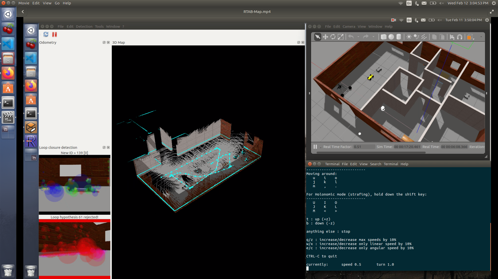
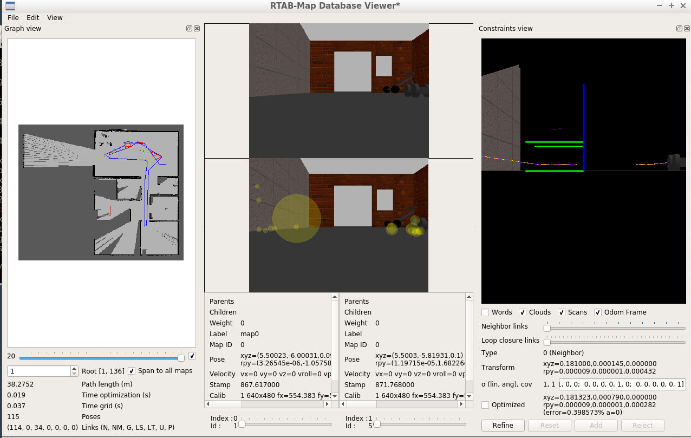

# Real-Time Appearance-Based Mapping
## Using Gazabo, Rviz, and ROS



## Setting up the enviroment:
For this project the following set up was used:
- Ubuntu 16.04 LTS OS
- Ros kinetic
- Gazebo 7.15.0
- Rviz 1.12.17

## Installation steps:
- Clone this repository to your home directory:
```
$ git clone https://github.com/AndresGarciaEscalante/Real-Time-Appearance-Based-Mapping.git
```
- Make sure you have the **rtabmap package installed**.

- Execute the following commands to setup the environment:
```
$ catkin_make
$ source devel/setup.bash
```
- Apply the following commands using different terminals:

 **Terminal 1**
```
$ source devel/setup.bash
$ roslaunch my_robot world.launch
```

 **Terminal 2**
```
$ source devel/setup.bash
$ rosrun teleop_twist_keyboard teleop_twist_keyboard.py
```

 **Terminal 3**
```
$ source devel/setup.bash
$ roslaunch my_robot mapping.launch
```
- Now you are able to drive the car using the keyboards and visualize the creation of the **3D Mapping**. The rtabmap will generate a **db file** after ending the simulation, this file contains all the information performed by the **RTAB** during simulation. This file can be visualized using the command:
```
$ rtabmap-databaseViewer ~/.ros/rtabmap.db
```
## Project Description
### My_robot Package
Contains the information of the **gazebo world environment**, **robot's URDF**. Additionally, it has all the launch files needed for the project.

### RTAB-Map Package
RTAB-Map (Real-Time Appearance-Based Mapping) is a popular solution for SLAM to develop robots that can map environments in 3D. RTAB-Map has good speed and memory management, and it provides custom developed tools for information analysis. Most importantly, the quality of the documentation on ROS Wiki (http://wiki.ros.org/rtabmap_ros) is very high. 

For more detailed information please refere to the following link:
[RTAB-Map Package](http://wiki.ros.org/rtabmap_ros)

### ROS Teleop Package
This package provides the control of velocity and movement of the car in the Gazebo environment.

For more detailed information please refere to the following link:
[ROS Teleop Package](https://github.com/ros-teleop/teleop_twist_keyboard)

## Project Outcome
Create a **2D occupancy grid** and **3D octomap** from a simulated environment using your own robot with the RTAB-Map package. 

The after the simulation the **db file** should look as follows. This example is provided in the repository:


**Important:** Check full video in the following link to get a deep understand of the project:
[RTAB-Map](https://www.youtube.com/watch?v=UjvRiylnfQM)

## Future Improvements
- Create a single launch file to execute the project.